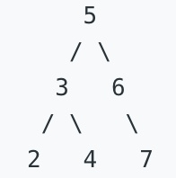
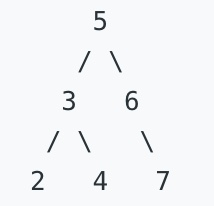

  # N Sum

- 1. <font color=green>Two Sum</font> `Array` `Hash Table`
- 167. <font color=green>Two Sum II - Input array is sorted</font> `Array` `Two Pointers` `Binary Search`
- 653. <font color=green>Two Sum IV - Input is a BST</font> `Tree`
- 15. <font color=orange>3Sum</font> `Array` `Two Pointers`
- 18. <font color=orange>4Sum</font> `Array` `Two Pointers` `Hash Table`

---

## 1. Two Sum

<font color=green>Easy</font> `Array` `Hash Table`

Given an array of integers, return ***indices*** of the two numbers such that they add up to a specific target.

You may assume that each input would have ***exactly*** one solution, and you may not use the same element twice.

**Example:**
`Given nums = [2, 7, 11, 15], target = 9`
`Because num[0] + nums[1] = 2 + 7 = 9`
`Return [0, 1].`

```python
class Solution:
    def twoSum(self, nums, target):
        """
        :type nums: List[int]
        :type target: int
        :rtype: List[int]
        """
        if len(nums) < 1:
            return False
        buff_dict = {}
        for i in range(len(nums)):
            if nums[i] in buff_dict:
                return [buff_dict[nums[i]], i]
            else:
                buff_dict[target-nums[i]] = i
```

---

## 167. Two Sum II - Input array is sorted

<font color=green>Easy</font> `Array` `Two Pointers` `Binary Search`

Given an array of integers that is already ***sorted in ascending order***, find two numbers such that they add up to a specific target number.

The function twoSum should return indices of the two numbers such that they add up to the target, where index1 must be less than index2.

**Note:**

- Your returned answers (both index1 and index2) are not zero-based.
- You may assume that each input would have exactly one solution and you may not use the same element twice.

**Example:**
`Input: numbers = [2,7,11,15], target = 9`
`Output: [1,2]`
`Explanation: The sum of 2 and 7 is 9. Therefore index1 = 1, index2 = 2.`

```python
# Two Pointers
class Solution:
    def twoSum(self, numbers, target):
        """
        :type numbers: List[int]
        :type target: int
        :rtype: List[int]
        """
        index_1 = 0
        index_2 = len(numbers) - 1
        while index_1 < index_2:
            if numbers[index_1] + numbers[index_2] > target:
                index_2 -= 1
            elif numbers[index_1] + numbers[index_2] < target:
                index_1 += 1
            else:
                return [index_1+1, index_2+1]
```

```python
# Hash Table
class Solution:
    def twoSum(self, numbers, target):
        """
        :type numbers: List[int]
        :type target: int
        :rtype: List[int]
        """
        dict = {}
        for i,num in enumerate(numbers, start = 1):
            if target-num in dict:
                return (dict[target-num], i)
            dict[num] = i
```

---

## 653. Two Sum IV - Input is a BST

<font color=green>Easy</font> `Tree`

Given a Binary Search Tree and a target number, return true if there exist two elements in the BST such that their sum is equal to the given target.

**Example 1:**
`Input: `

`Target = 9`
`Output: True`

**Example 2:**
`Input: `

`Target = 28`
`Output: False`

**Personal Solution**

```python
class Solution:
    def findTarget(self, root, k):
        """
        :type root: TreeNode
        :type k: int
        :rtype: bool
        """
        nums = []
        self.inOrderTraverse(root, nums)
        buff_dict = {}
        for i, num in enumerate(nums):
            if num not in buff_dict:
                buff_dict[k-num] = i
            else:
                return True

        return False
    
    def inOrderTraverse(self, node, nums):
        if node:
            self.inOrderTraverse(node.left, nums)
            nums.append(node.val)
            self.inOrderTraverse(node.right, nums)
```

**For Reference**

```python
class Solution:
    def findTarget(self, root: TreeNode, k: int) -> bool:
        dic={}
        queue=[root]
        while queue and root:
            node=queue.pop(0)
            if k-node.val in dic :
                return True
            dic[node.val]=0
            if node.left:
                queue.append(node.left)
            if node.right:
                queue.append(node.right)
        return False
```

---

## 15. 3Sum

<font color=orange>Medium</font> `Array` `Two Pointers`

Given an array ***nums*** of ***n*** integers, are there elements ***a***, ***b***, ***c*** in ***nums*** such that ***a + b + c = 0***? Find all unique triplets in the array which gives the sum of zero.

**Note:**

- The solution set must not contain duplicate triplets.

**Example:**
`Given array nums = [-1, 0, 1, 2, -1, -4],`
`A solution set is:`
`[`
`  [-1, 0, 1],`
`  [-1, -1, 2]`
`]`

```python
# 1372 ms
class Solution:
    def threeSum(self, nums: List[int]) -> List[List[int]]:
        nums.sort()
        num_len = len(nums)
        result = []
        for i in range(num_len):
            if i>0 and nums[i] == nums[i-1]:
                continue
            s = i + 1
            e = num_len - 1
            while s < e:
                if nums[s] + nums[e] == -1 * nums[i]:
                    result.append([nums[i], nums[s], nums[e]])
                    s += 1
                    while s<e and nums[s] == nums[s-1]:
                        s += 1
                elif nums[s] + nums[e] < -1 * nums[i]:
                    s += 1
                else:
                    e -= 1
        return result
```

```python
class Solution:
    def threeSum(self, nums: List[int]) -> List[List[int]]:
        result = set()
        buff_dict = {}
        num_len = len(nums)
        nums.sort()
        
        for i in range(num_len):
            for j in range(i+1, num_len):
                two_sum = - (nums[i] + nums[j])
                if two_sum in buff_dict:
                    buff_dict[two_sum].append([i, j])
                else:
                    buff_dict[two_sum] = [[i, j]]
        
        for i in range(num_len):
            if i > 0 and nums[i] == nums[i-1]:
                continue
            if nums[i] in buff_dict:
                for k in buff_dict[nums[i]]:
                    if k[0] > i:
                        result.add((nums[i], nums[k[0]], nums[k[1]]))
        
        return list(result)
```

```python
// sample 280 ms submission
class Solution:
    def threeSum(self, nums: 'List[int]') -> 'List[List[int]]':
        from bisect import bisect_left, bisect_right
       
        target = 0
        
        result = []
        length = len(nums)
        
        if length < 3:
            return result
        
        count ={}
        # map the counts
        for n in nums:
            if n in count:
                count[n] += 1
            else:
                count[n] = 1
            
        keys = list(count.keys())
        keys.sort()
      
        t3 = target // 3
        if t3 in keys and count[t3] >= 3:
            result.append([t3, t3, t3])

        begin = bisect_left(keys, target - keys[-1] * 2)
        end = bisect_left(keys, target * 3)

        for i in range(begin, end):
            a = keys[i]
            if count[a] >= 2 and target - 2 * a in keys:
                result.append([a, a, target - 2 * a])

            max_b = (target - a) // 2  # target-a is remaining
            min_b = target - a - keys[-1]  # target-a is remaining and c can max be keys[-1]
            b_begin = max(i + 1, bisect_left(keys, min_b))
            b_end = bisect_right(keys, max_b)

            for j in range(b_begin, b_end):
                b = keys[j]
                c = target - a - b
                if c in count and b <= c:
                    if b < c or count[b] >= 2:
                        result.append([a, b, c])
        return result
```

---

## 18. 4Sum

<font color=orange>Medium</font> `Array` `Two Pointers` `Hash Table`

Given an array ***nums*** of ***n*** integers and an integer ***target***, are there elements ***a***, ***b***, ***c***, and ***d*** in ***nums*** such that ***a + b + c + d = target***? Find all unique quadruplets in the array which gives the sum of ***target***.

**Note:**

- The solution set must not contain duplicate quadruplets.

**Example:**
`Given array nums = [1, 0, -1, 0, -2, 2], and target = 0.`
`A solution set is:`
`[`
`  [-1,  0, 0, 1],`
`  [-2, -1, 1, 2],`
`  [-2,  0, 0, 2]`
`]`

```python
class Solution:
    def fourSum(self, nums, target):
        """
        :type nums: List[int]
        :type target: int
        :rtype: List[List[int]]
        """
        num_len = len(nums)
        buff_dict = {}
        ans = set()
        nums.sort()

        # border conditions
        if len(nums) < 4 or 4 * nums[0] > target or 4 * nums[num_len - 1] < target:
            return []

        # sum of every 2-element pair
        for i in range(num_len):
            for j in range(i + 1, num_len):
                _sum = nums[i] + nums[j]
                if _sum not in buff_dict:
                    buff_dict[_sum] = [[i, j]]
                else:
                    buff_dict[_sum].append([i, j])

        # match the sum of other 2-element pair, and check they are not the same elements as the first 2 elements
        for i in range(num_len):
            for j in range(i + 1, num_len):
                _cha = target - (nums[i] + nums[j])
                if _cha in buff_dict:
                    for k in buff_dict[_cha]:
                        if k[0] > j:
                            ans.add((nums[i], nums[j], nums[k[0]], nums[k[1]]))
        return list(ans)
```
