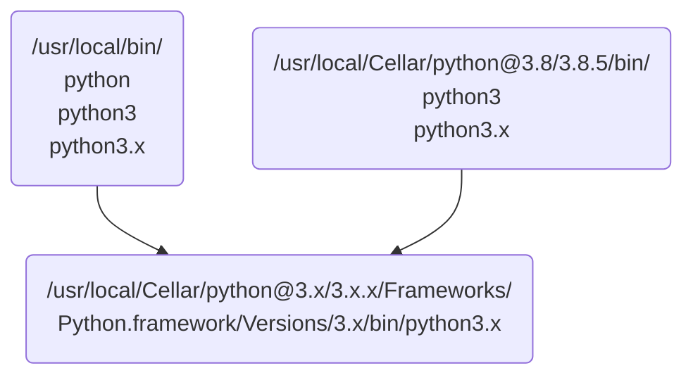
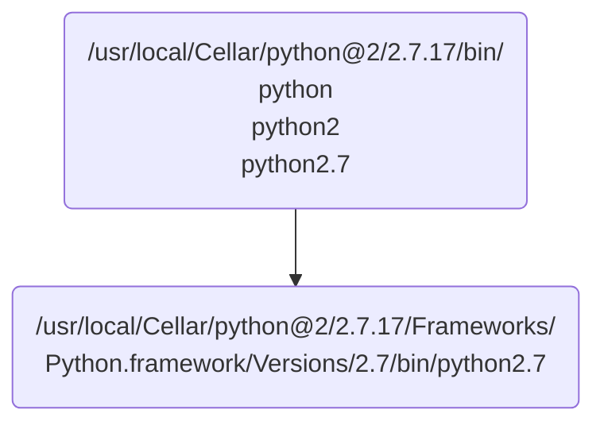
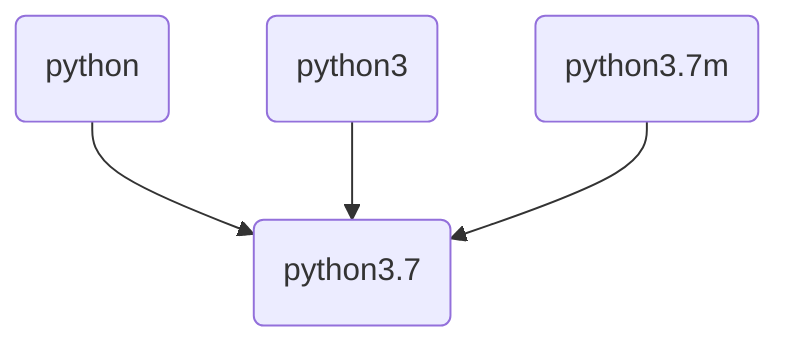
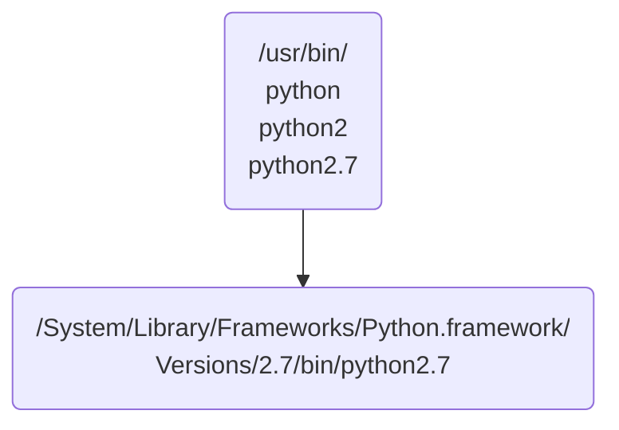

#Current Python Enviroment on Mac

## <font color="#0099ff">Homebrew Python3 [Default]</font>

```
$which python
/usr/local/bin/python
```




## <font color="#0099ff">Homebrew Python2</font>



## <font color="#0099ff">Anaconda Python3</font>

```
$ which python
/Users/jkfan/opt/anaconda3/bin/python
```



## <font color="#0099ff">Built-In Python2</font>

```
$ which python2:
/usr/bin/python2
```

