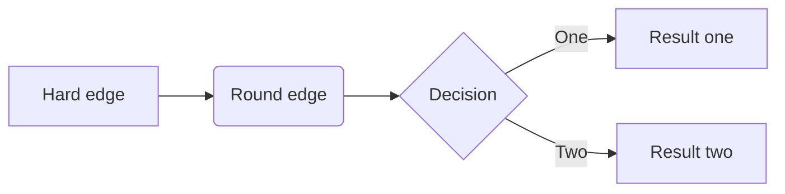
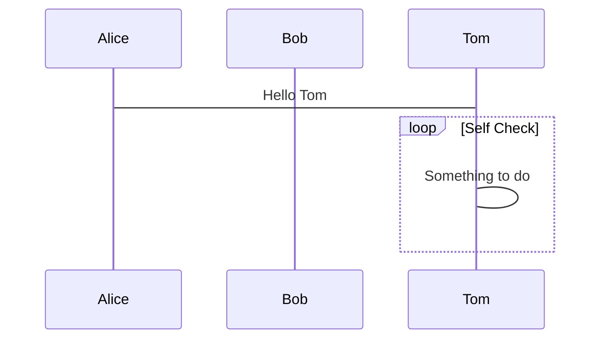
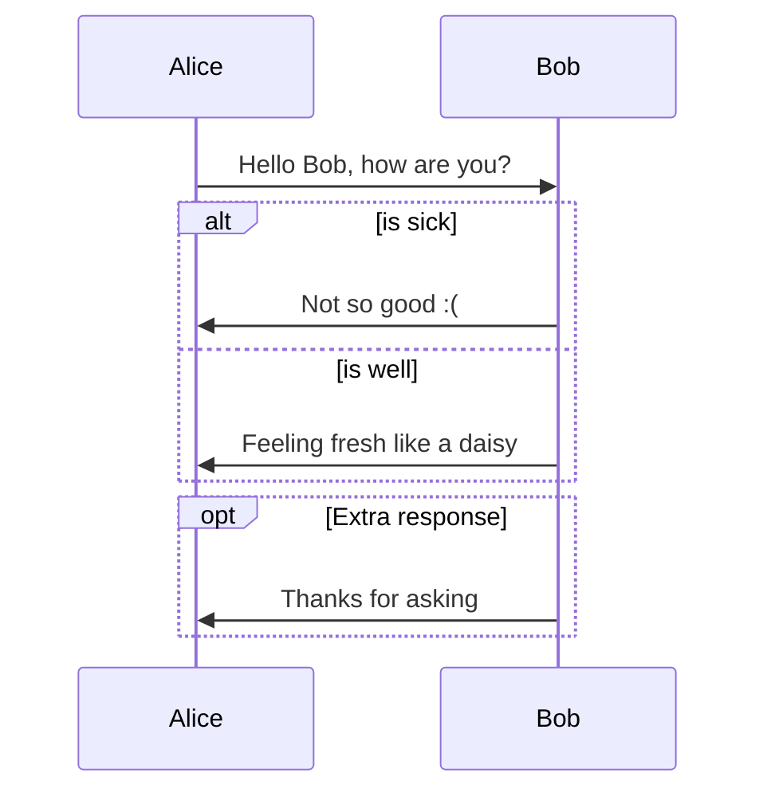

```sequence
Alice -> Bob: Hello Bob
Bob -> Tom: Hello Tom
Bob --> Alice: I'm good
note left of Alice: Alice\nthinks
note right of Bob: Bob\nthinks
note over Tom: note
```

```flow
st=>start: Start:>http://www.google.com[blank]
e=>end:>http://www.google.com
op1=>operation: My Operation
sub1=>subroutine: My Subroutine
cond=>condition: Yes
or No?:>http://www.google.com
io=>inputoutput: catch something...
para=>parallel: parallel tasks

st->op1->cond
cond(yes)->io->e
cond(no)->para
para(path1, bottom)->sub1(right)->op1
para(path2, top)->op1
```

```flow
st=>start: Start|past:>http://www.google.com[blank]
e=>end: End|future:>http://www.google.com
op1=>operation: My Operation|past
op2=>operation: Stuff|current
sub1=>subroutine: My Subroutine|invalid
cond=>condition: Yes
or No?|approved:>http://www.google.com
c2=>condition: Good idea|rejected
io=>inputoutput: catch something...|future

st->op1(right)->cond
cond(yes, right)->c2
cond(no)->sub1(left)->op1
c2(yes)->io->e
c2(no)->op2->e
```

[](https://travis-ci.org/joemccann/dillinger)

<table><tr><td bgcolor=orange>背景色是：orange</td></tr></table>

```cpp
struct {
  int year;
  int month;
  int day;
 }bdate;
```

<font face="黑体">我是黑体字</font>
<font face="微软雅黑">我是微软雅黑</font>
<font face="STCAIYUN">我是华文彩云</font>
<font color=#0099ff size=7 face="黑体">color=#0099ff size=72 face="黑体"</font>
<font color=#00ffff size=72>color=#00ffff</font>
<font color=gray size=72>color=gray</font>

Size：规定文本的尺寸大小。可能的值：从 1 到 7 的数字。浏览器默认值是 3
